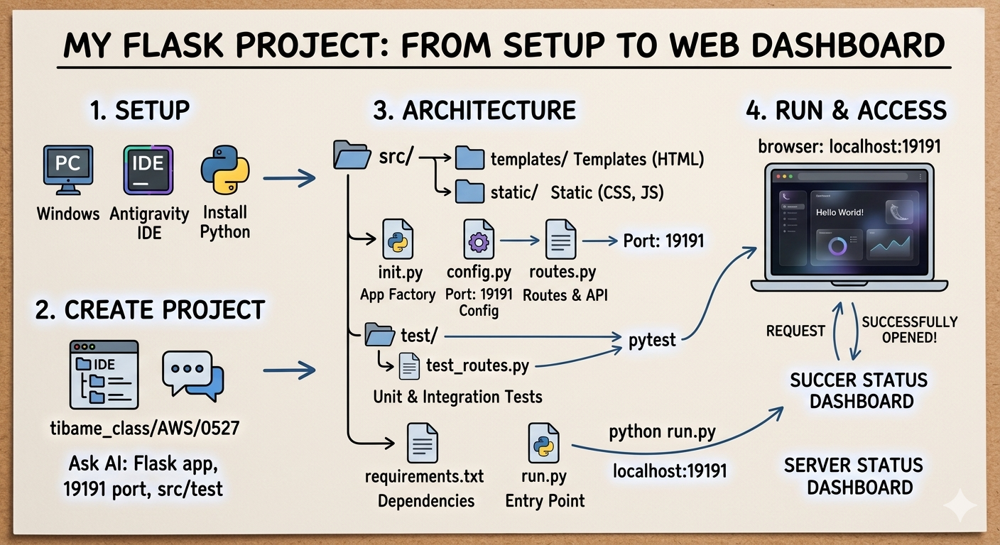
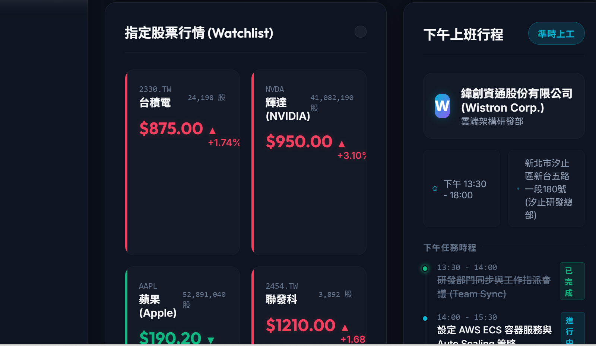
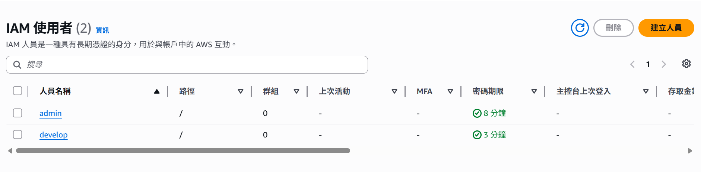
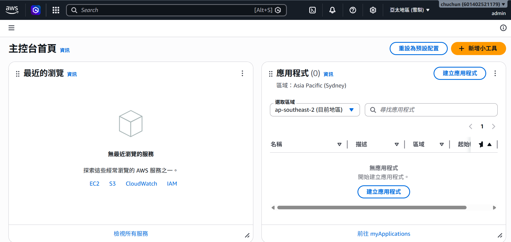
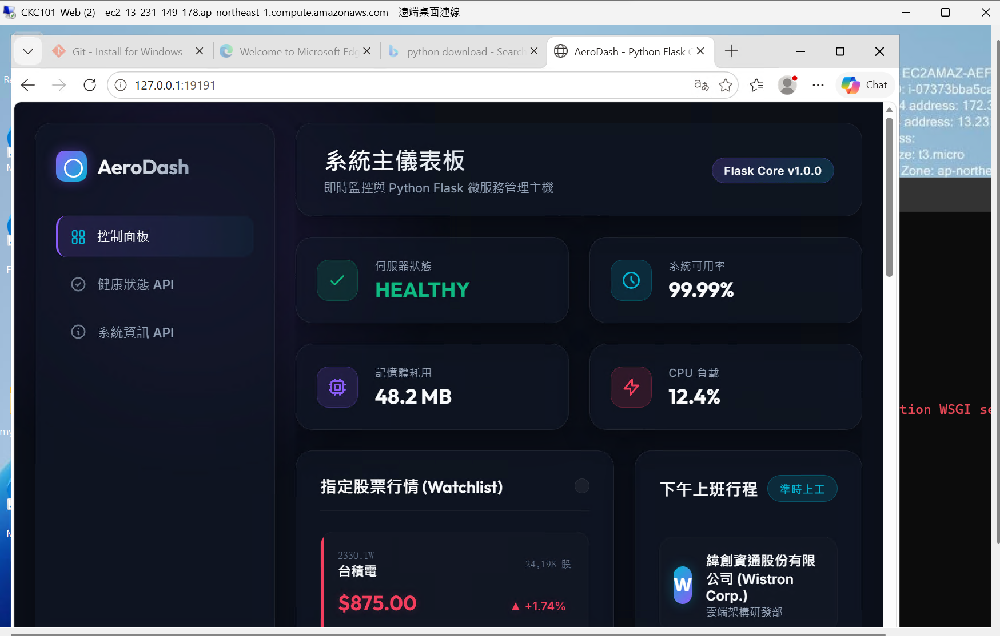

# 學習筆記

# 利用google antigravity ide建立Web應用

## 🚀  Python Flask 的 Web 儀表板實作流程

### 架構圖



### 📥 1. 環境建置 (SETUP)

在開始寫程式之前，先準備好本地端的基礎開發環境：

- **作業系統：** 使用 Windows 實體電腦。
- **開發工具：** 採用 Antigravity IDE（整合開發環境）進行程式碼編寫與專案管理。
- **核心語言：** 安裝 Python 執行環境，作為後端服務的核心引擎。

### 🛠️ 2. 初始化專案 (CREATE PROJECT)

建立清晰的專案管理路徑，並善用 AI 工具加速開發：

- **目錄管理：** 在本地端建立專屬的課程學習路徑 `tibame_class/AWS/0527`。
- **AI 協同開發：** 透過向 AI 精準提問（Prompting），定義核心需求：
    
    > *「請幫我建立一個 Flask 應用程式，指定運行於 Port 19191，並規劃 `src/`（原始碼）與 `test/`（測試）的分離架構。」*
    > 

### 🏗️ 3. 專案架構設計 (ARCHITECTURE)

專案採用業界標準的模組化與結構化設計，目錄架構與檔案職責如下：

```
my-flask-project/
├── src/                          # 核心原始碼資料夾
│   ├── templates/                # 存放前端 HTML 模板網頁
│   ├── static/                   # 存放靜態檔案 (CSS 樣式表表、JavaScript 腳本)
│   ├── __init__.py               # 初始化檔案，負責 App Factory (應用程式工廠) 的設定
│   ├── config.py                 # 全域設定檔，指定網頁運行的 Port 為 19191
│   └── routes.py                 # 路由與 API 邏輯控制器 (定義網頁路徑)
├── test/                         # 單元與整合測試資料夾
│   └── test_routes.py            # 針對 routes.py 進行的自動化測試腳本
├── requirements.txt              # 套件依賴清單 (記錄 Flask, pytest 等版本)
└── run.py                        # 專案啟動進入點 (Entry Point)
```

- **測試機制：** 導入 `pytest` 測試框架，確保 `test_routes.py` 能夠自動化驗證路由的正確性。

### 💻 4. 運行與訪問驗證 (RUN & ACCESS)

完成代碼編寫後，進行本地端服務的啟動與測試：

- **啟動服務：** 在終端機執行指令 `python run.py`，將 Flask 內建的 Web 伺服器在本地端跑起來。
- **瀏覽器訪問：** 開啟瀏覽器輸入本地網址：`http://localhost:19191`。
- **結果驗證：** 瀏覽器發送 Request（請求）後，伺服器成功回傳運算結果，並在螢幕上完美渲染**狀態儀表板 (Server/Succer Status Dashboard)**。



## AWS帳號建立

先準備 **4 樣東西**，能讓註冊過程最順利：

1. **電子郵件信箱**（用來當作 Root 根帳號登入）。
2. **手機**（用來接收簡訊驗證碼）。
3. **信用卡或金融卡**（VISA、MasterCard、JCB 皆可，會扣除 1 美元進行身分驗證，隨後會退還）。
4. **護照或英文地址**（註冊時需要輸入英文帳單地址，可先到郵局網站查詢「中文地址英譯」）。

### 🛠️ AWS 帳號註冊 5 大步驟

#### 步驟 1：前往官網並輸入帳號資訊

1. 打開瀏覽器，前往 [AWS 台灣官網](https://aws.amazon.com/tw/)。
2. 點擊右上角的 **「建立 AWS 帳戶」** 服務。
3. 輸入你的**電子郵件地址**以及你想取的 **AWS 帳戶名稱**（之後進去可以修改），然後點擊「驗證電子郵件地址」。
4. 到你的信箱收驗證碼，輸入後即可通過第一關。

#### 步驟 2：設定密碼與聯絡資訊

1. 設定你的強密碼（強烈建議用筆記本記下來，這是最高權限的根帳號）。
2. 填寫聯絡資訊：
    - **帳戶類型：** 請務必勾選 **「個人 (Personal)」**（除非你是代表公司行號）。
    - **基本資料：** 姓名、電話、國家（台灣）。
    - **地址：** 請填寫**英文地址**（可以利用郵局中譯英系統複製貼上）。

#### 步驟 3：綁定信用卡（重要驗證）

1. 輸入你的信用卡或金融卡卡號、到期日與持卡人姓名。
2. AWS 會發起一筆 **1 美元（約台幣 30-33 元）的測試刷卡**，這只是用來確認這張卡是真的、活著的，**並不會真的扣款**（幾天內銀行就會釋放這筆額度）。

#### 步驟 4：手機簡訊與身分確認

1. 選擇驗證方式為 **「文字簡訊 (SMS)」**。
2. 選擇國碼 `+886`（台灣），並輸入你的手機號碼（去掉開頭的 0，例如 `912345678`）。
3. 輸入畫面上的圖形驗證碼，點擊「傳送簡訊」。
4. 手機收到 4 位數驗證碼後，輸入到網頁上完成驗證。

#### 步驟 5：選擇支援方案

最後一步會讓你選擇 AWS 的方案，畫面上通常有三個選項：

1. **基本支援 - 免費 (Basic Support - Free) ◄【請絕對要選這一個】**
2. 開發人員支援 (Developer Support)
3. 商業支援 (Business Support)

> ⚠️ **新手警報：** 務必點選 **「基本支援 - 免費」**。選錯的話，每個月會被自動扣繳數十到數百美元的會員費喔！
> 

點擊確認後，你的 AWS 帳號就註冊完成了！

## 啟用 MFA（多因素驗證）

### 🚨 為什麼 Root 帳號一定要開 MFA？

剛剛註冊的帳號叫做 **Root Account（根帳號）**，它擁有這個 AWS 帳戶的**最高絕對權限**。

1. **防止駭客拿你的卡去「挖礦」：** 現在網路上有非常多自動化爬蟲，專門在尋找密碼強度不足、或防護不夠的 AWS 帳號。一旦駭客攻破你的帳號，他們會立刻在幾分鐘內開滿幾百台高規格的 EC2 伺服器來幫他們挖泰達幣或比特幣。當你隔天醒來，可能就會收到高達數萬美元（幾十萬台幣）的 AWS 帳單。
2. **多一層密碼之外的肉盾：**
開了 MFA 之後，就算駭客猜到、或用木馬程式偷到了你的密碼，他們在登入時依然會被卡住，因為他們拿不到你手機上每 30 秒變更一次的動態驗證碼。

### 🛠️ 設定步驟

1. 先在手機上下載一個驗證器 App。**Google Authenticator** (Google 驗證器)
2. 登入你的 [AWS 管理主控台 (AWS Console)](https://aws.amazon.com/tw/console/)。
3. 點擊右上角你的**帳戶名稱**，在下拉選單中選擇 **「Security Credentials」（安全性憑證）**。
4. 往下滾動找到 **「Multi-factor authentication (MFA)」** 區塊，點擊右邊的 **「Assign MFA device」（指派 MFA 裝置）**。
5. **填寫設定：**
    - **Device name（裝置名稱）：** 輸入你方便識別的名字，例如 `my-phone`。
    - **MFA device type：** 選擇 **「Authenticator app」（驗證器應用程式）**。
6. 點擊 Next（下一步）後，畫面上會出現一個 **QR Code**。
7. 打開你手機上的 Google Authenticator App，點擊右下角的 **「+」號 -> 掃描 QR 條碼**
8. 掃描後，手機 App 上就會出現一個名為 `Amazon Web Services` 的 6 位數數字。
9. **最後驗證：**
    - 在電腦網頁上的 `MFA code 1` 輸入現在手機顯示的數字。
    - 等 30 秒，等手機跳出**下一組**新的數字，輸入到 `MFA code 2`。
10. 點擊 **「Add MFA」（新增 MFA）** 就大功告成了！

<aside>
💡

設定成功後，以後你每次登入 AWS，輸入完密碼後，網頁就會多跳出一個視窗問你「請輸入 MFA 驗證碼」，這個小動作能讓你的安全性提升 99.9%，不用提心吊膽怕帳號被盜囉！

</aside>

## 設定預算警示 (AWS Budgets)

**費用預警（AWS Budgets）**是AWS 的第二道防線，防止因為「忘記關閉伺服器」而產生意外帳單。

### 🛠️ AWS 費用預警設定 5步驟

#### 步驟 1：前往 AWS Budgets 服務

1. 登入你的 AWS 管理主控台（AWS Console）。
2. 在頂部的搜尋欄輸入 **`Budgets`**，並點選搜尋結果中的 **「Budgets」（預算）**。
3. 進入頁面後，點擊右上角的藍色按鈕 **「Create budget」（建立預算）**。

#### 步驟 2：選擇預算類型

1. 畫面上會出現多個選項，請選擇第一個 **「Cost budget - Recommended」（成本預算 - 建議）**。
2. 點擊下一步 (Next)。

#### 步驟 3：設定預算金額（以 1 美元為例）

1. **預算詳細資訊 (Budget details)：**
    - **Period（週期）：** 選擇 **`Monthly`（每月）**。
    - **Budget effective date（生效日期）：** 選擇 `Recurring budget`（定期預算，每個月底自動重置）。
2. **預算金額 (Budget amount)：**
    - **Budgeting method（預算方法）：** 選擇 `Fixed`（固定金額）。
    - **Enter your budgeted amount（輸入你的預算金額）：** 輸入 **`1`** (代表 1 美元，折合台幣約 30-33 元)。
3. 給你的預算取個名字，例如：`my-class-budget`，然後點擊下一步 (Next)。

#### 步驟 4：設定警報觸發條件（什麼時候通知你）

這是最關鍵的一步，我們要設定當費用快超過時，讓 AWS 發信警告你：

1. 點擊 **「Add an alert threshold」（新增警示閾值）**。
2. **設定觸發點：**
    - **Threshold（閾值）：** 輸入 **`80`**。
    - **Trigger（觸發基準）：** 選擇 **`% of budgeted amount`（預算金額的百分比）**。
    - *這樣設定代表：當月花費達到 0.8 美元（1 美元的 80%）時，就會觸發警報。*
3. **Notification preferences（通知偏好設定）：**
    - 在 **Email recipients（電子郵件收件人）** 欄位中，**輸入你的 Email 信箱**（可以輸入多個，用逗號隔開）。

> 💡 **進階小技巧（選做）：** 你可以再點擊一次「Add an alert threshold」，新增第二個警報，將 Threshold 設為 **`100` %**，這樣只要一突破 1 美元，你就會收到第二封緊急求救信。
> 

#### 步驟 5：檢查並建立

1. 點擊下一步 (Next)，檢查所有設定是否正確。
2. 確認無誤後，滾動到最下方點擊 **「Create budget」（建立預算）**。

### 成功建立預算限制


## IAM**（Identity and Access Management 身分與存取管理）**

**IAM 就是 AWS 雲端世界裡的「門禁與權限管理系統」。**

### 1. 為什麼需要 IAM？（核心觀念）

你剛剛註冊的帳號叫做 **Root User（根帳號）**。
想像一下，如果你今天在 Tibame 的專案小組要一起做報告，或者你進了公司，你絕對不會把「綁定你信用卡的 Root 帳號密碼」直接分給其他組員或同事，因為這就像把家裡的保險箱鑰匙直接送人一樣危險。

這時候，你就要利用 **IAM** 來：

1. 為每個人建立一組獨立的帳號密碼（**身分**）。
2. 設定每個人只能動哪些東西，不能動哪些東西（**權限**）。

### 2. IAM 的四大核心元件 (The Big Four)

在筆記裡，你可以把 IAM 拆解成這四個最常考、也最常用的基礎元件：

| **元件名稱** | **英文名稱** | **簡單比喻** | **實際做什麼** |
| --- | --- | --- | --- |
| **使用者** | **User** | 員工識別證 | 代表一個「具體的人」（例如：你、同學 A）。每個人有自己的密碼。 |
| **群組** | **Group** | 部門（如：開發部） | 把多個 User 集合在一起。只要對群組設定權限，裡面的所有人就會自動套用。 |
| **政策** | **Policy** | 權限同意書 | 一份 **JSON 格式的合約**，裡面詳細寫著「允許（Allow）」或「拒絕（Deny）」什麼行為。 |
| **角色** | **Role** | 職務代理人（面具） | **這不是給人用的，通常是給「AWS 服務」戴的面具**。例如：允許一台 EC2 伺服器去讀取 S3 儲存桶的檔案。 |

### 3. 實戰架構流向圖

當一個使用者登入 AWS 想要存取資源（例如查看網頁或啟動 EC2）時，IAM 是這樣在後台進行檢查的：

```
【 使用者 User: Alice 】
      │
      ├─► 嘗試執行指令：啟動一台 EC2 伺服器
      ▼
【 AWS IAM 門禁系統 】
      │
      ├─► 1. 檢查身分 (Authentication)：妳是 Alice 沒錯。
      │
      ├─► 2. 檢查群組 (Group)：Alice 屬於「網頁開發小組」。
      │
      ├─► 3. 檢查政策 (Policy)：
      │      │
      │      └─── 讀取 JSON 設定檔 ──────────────────────────┐
      │           {                                          │
      │             "Effect": "Allow",                       │
      │             "Action": "ec2:RunInstances",  ◄─────────┼─ 發現允許啟動 EC2！
      │             "Resource": "*"                          │
      │           }                                          │
      │                                                      │
      ▼                                                      ▼
【 授權通過 (Authorization) 】 ────────────────────────► 【 🚀 成功建立 EC2 伺服器 】
```

### 💡 課程必背：IAM 的黃金三大原則

1. **最小權限原則 (Least Privilege)：** 只給予使用者「剛好能完成工作」的最低權限。如果同學只需要看報告，就只給他 `ReadOnly`（唯讀），絕對不給他 `Admin`（管理員）權限。
2. **多用 Group，少對單一 User 設定權限：**
當有 10 個新同學加入，一個一個發權限會瘋掉。正確做法是建立一個「Tibame-Class-Group」，把權限貼在群組上，再把 10 個人丟進群組裡。
3. **不要用 Root 帳號做日常工作：**
辦好帳號後，請用 IAM 幫自己建一個具有高權限的 `admin` 使用者，以後上課練習都用這組 IAM 帳號登入。把最危險的 Root 帳號鎖進保險箱。

### 實作(建立兩個帳號，管理admin 、開發develop)

這在業界是最標準的 **「職責分離 (Separation of Duties)」** 最佳實踐。

這兩個帳號在你的 AWS 學習之旅中分別扮演不同的角色：

1. **管理員 (admin)：** 負責日常的雲端架構管理（像是設定網路、開啟伺服器）。建立好這個帳號後，你就可以把權限太大的 Root 帳號鎖起來了。
2. **開發人員 (develop)：** 權限比較受限，通常只給予開發、部署程式碼所需的權限（例如寫入 S3、讀取特定服務），這是用來模擬未來把程式碼交給團隊其他成員時的場景。

### 🛠️ 實戰：建立管理與開發 IAM 使用者

#### 步驟 1：前往 IAM 主控台

1. 在 AWS Console 頂部搜尋欄輸入 **`IAM`**，點擊進入。
2. 在左側選單點選 **「使用者 (Users)」**，然後點擊右上角的 **「建立使用者 (Create user)」**。

#### 步驟 2：建立管理員 (admin)

1. **使用者詳細資訊：**
    - 使用者名稱輸入：`admin`
    - 勾選 **「提供使用者存取 AWS 管理主控台的權限」**（這會讓這個帳號有網頁密碼）。
    - 選擇 **「我想建立 IAM 使用者」**（預設通常是這個）。
    - **主控台密碼：** 選擇「自訂密碼」並輸入一組你記得住的密碼。
    - **取消勾選**「使用者在下次登入時必須建立新密碼」（自己練習用的，不需要強迫換密碼）。
2. **設定權限：**
    - 選擇 **「直接連接政策 (Attach policies directly)」**。
    - 在權限清單搜尋欄輸入：`AdministratorAccess`。
    - **勾選 `AdministratorAccess`**（這會給予它完整的系統管理權限）。
3. **檢查並建立：**
    - 點擊下一步，確認名稱是 `admin` 且權限是 `AdministratorAccess` 後，點擊 **「建立使用者」**。
    - ⚠️ **重要：** 建立成功後，畫面上會出現一個 **「主控台登入 URL」**（長得像 `https://xxxx.signin.aws.amazon.com/console`），請把它**複製並存到你的筆記本裡**！以後你都要用這個專屬網址登入。

#### 步驟 3：建立開發人員 (develop)

1. 再次點擊 **「建立使用者 (Create user)」**。
2. **使用者詳細資訊：**
    - 使用者名稱輸入：`develop`
    - 重複上述設定（勾選主控台權限、設定自訂密碼、取消強制換密碼）。
3. **設定權限（通常會限制權限）：**
    - 選擇 **「直接連接政策 (Attach policies directly)」**。
    - 既然你是要部署 Python Web 應用，老師可能會讓你們選 `PowerUserAccess`（擁有除了管理 IAM 以外的所有開發權限）或者更低的 `ReadOnlyAccess`（唯讀）。
    - *💡 註：如果老師課堂上有指定特定的 Policy，請依老師上課勾選的為準。若還沒指定，可以先勾選 **`PowerUserAccess`**。*
4. 點擊下一步並完成建立。

### 📊 IAM 帳號權限架構圖

```
     👑 【 Root User (根帳號) 】
     │   (最高絕對權限、綁定信用卡、掌控所有預算)
     │   ➔ ⚠️ 辦好下面兩個帳號後，這顆章就該鎖進保險箱！
     │
     ├─────────────────────────────────────────┐
     ▼                                         ▼
🛠️【 IAM User: admin 】                  💻【 IAM User: develop 】
     │                                         │
[ 綁定 Policy 權限 ]                       [ 綁定 Policy 權限 ]
➔ AdministratorAccess                      ➔ PowerUserAccess / 指定權限
     │                                         │
     ▼                                         ▼
(可以管理所有人、開關所有服務)             (只能寫 Code、部署專案，)
(日常課程練習、開 EC2 都用它)               (不能動別人的帳號和帳單)
```

### 成功建立使用者



### 以admin身分登入

#### 1. 登入介面的三大核心差異

當你打開 AWS 的登入畫面時，你會發現以下三個地方有明顯的不同：

| 比較項目 | 1. 之前的登入方式 (Root 帳號) | 2. 現在的管理員登入方式 (IAM admin) |
| --- | --- | --- |
| **登入網址** | **通用網址**
`https://aws.amazon.com/` | **專屬網址**（包含你的 12 位數帳戶 ID）
`https://[你的帳戶ID].signin.aws.amazon.com/console` |
| **第一步畫面** | 必須勾選 **「根使用者 (Root user)」** | 必須勾選 **「IAM 使用者 (IAM user)」** |
| **需要輸入的欄位** | 1. 根帳號的 **Email 信箱**
2. 密碼
3. MFA 驗證碼 | 1. **帳戶 ID**（若用專屬網址會自動填好）
2. 使用者名稱（輸入 **`admin`**）
3. 密碼 |

#### 2. 登入流程對比與介面架構圖

```
【 門口 A：根使用者入口 (Root User) 】          【 門口 B：IAM 使用者入口 (IAM User) 】
       (登入通用網址：aws.amazon.com)                 (登入專屬網址：包含 12 位數帳戶 ID)
                  │                                               │
                  ▼                                               ▼
         ┌─────────────────┐                             ┌─────────────────┐
         │ ⊙ 根使用者 (Root) │                             │ ⊙ IAM 使用者     │
         └─────────────────┘                             └─────────────────┘
                  │                                               │
         [ 填寫欄位 ]                                     [ 填寫欄位 ]
         ├─► 電子郵件信箱 (0527)                          ├─► 帳戶 ID (12位數數字)
         └─► 密碼                                        ├─► 使用者名稱 (admin)
                  │                                       └─► 密碼
                  ▼                                               ▼
         【 🔒 輸入 MFA 驗證 】                           【 🔒 輸入密碼直接登入 】
                  │                                               │
                  ▼                                               ▼
     👑【 進入 AWS 最高控制台 】                      🛠️【 進入 AWS 管理員控制台 】
       (掌控信用卡、帳單、生死大權)                      (日常開發、管理網路、開關 EC2)
       ➔ 💡 沒事不要走這個門！                           ➔ 💡 課堂練習一律走這個門！
```

#### 3. 如何用管理員 (admin) 帳密順利登入？

請跟著以下步驟進行登入：

1. 開啟瀏覽器（建議開**無痕視窗**，避免瀏覽器記錄舊的 Root 帳號 Cookie）。
2. 貼上你剛才建立 `admin` 出現的**專屬登入網址**。
3. 畫面會貼心地幫你填好第一欄的「帳戶 ID」（12 位數）。
4. 在使用者名稱輸入 **`admin`**，並輸入你為它設定的自訂密碼。
5. 點擊登入，你就會順利進入 AWS 的世界了！
6. 當你成功用管理員登入後，看一下網頁的**右上方**，你會看到原本顯示 Email 的地方，變成了：
`admin @ [你的帳戶名稱或ID]`

#### 成功登入畫面



### AWS_EC2_作為部屬用

租一台windows server，並3389port有開通，為這台server使用CKC101這個key pair

#### 🛠️ 第一部分：先建立名為 `CKC101` 的 Key Pair（金鑰對）

在 Windows Server 建立完成後，我們需要這把金鑰來「解密」取得 Windows 的初始管理員密碼。

1. **進入 EC2 主控台：**
    - 在 AWS 上方搜尋欄輸入 **`EC2`**，點擊進入。
2. **找到金鑰對設定：**
    - 在左側選單往下滾動，找到 **「網路與安全 (Network & Security)」** 區塊，點擊 **「金鑰對 (Key Pairs)」**。
3. **建立金鑰：**
    - 點擊右上角的 **「建立金鑰對 (Create key pair)」**。
    - **名稱：** 輸入 **`CKC101`**（大小寫要完全一樣）。
    - **金鑰對類型：** 選擇 **`RSA`**。
    - **私有金鑰檔案格式：**
        - 如果你使用的是 Windows 內建的遠端桌面連線（RDP），選擇 **`.pem`** 即可。
4. **下載與保存：**
    - 點擊 **「建立金鑰對」** 後，瀏覽器會**自動下載**一個名為 `CKC101.pem` 的檔案。
    - ⚠️ **重要：** 請把這個檔案妥善存好（例如放到你的 Tibame 課程專案資料夾），這把鑰匙如果丟了，等一下會沒辦法登入 Windows 喔！

#### 🖥️ 第二部分：啟動 Windows Server 並開通 3389 Port

1. **前往啟動頁面：**
    - 點擊左側選單最上方的 **「EC2 儀表板 (EC2 Dashboard)」**。
    - 點擊畫面的橘色按鈕 **「啟動執行個體 (Launch instance)」**。
2. **設定名稱：**
    - **名稱 (Name)：** 輸入你想取的名字，例如 `Tibame-Windows-Server`。
3. **選擇作業系統 (AMI)：**
    - 在「應用程式和作業系統影像」下方，點選 **「Windows」** 圖示。
    - 在「亞馬遜機器影像 (AMI)」下拉選單中，確認它選擇的是帶有 **`Free tier eligible`（符合免費資格）** 的版本，例如：`Microsoft Windows Server 2022 Base`。
4. **選擇規格 (Instance type)：**
    - 預設應該會是 **`t2.micro`**（或部分區域是 `t3.micro`），請確認它旁邊有寫 **`Free tier eligible`**，這樣練習就不會產生非預期的費用。
5. **綁定金鑰對 (Key pair)：**
    - 在「金鑰對」欄位，點開下拉選單，選擇你剛剛建立的 **`CKC101`**。
6. **設定網路與安全組（開通 3389 Port）：**
    - 往下走到「網路設定 (Network settings)」，點擊右上角的 **「編輯 (Edit)」**。
    - **防火牆 (Security groups)：** 選擇「建立安全性群組」。
    - **安全性群組名稱：** 可以改成好辨認的名字，例如 `Windows-RDP-SG`。
    - **輸入安全性群組規則 (Inbound security groups rules)：**
        - **類型 (Type)：** 選擇 **`RDP`**（選了之後，你會發現右邊的 Port 範圍會自動帶入 **`3389`**）。
        - **來源類型 (Source type)：** * 課堂練習建議先選擇 **「我的 IP (My IP)」**，這會最安全，只有你家/目前的網路能連。
            - 如果等一下上課同學或老師要一起連，可以先選 **「任何位置 (Anywhere-IPv4)」**（即 `0.0.0.0/0`），但日常實務上這比較危險。
7. **啟動伺服器：**
    - 其他設定維持預設，直接點擊右側的橘色按鈕 **「啟動執行個體 (Launch instance)」**！

#### ⏳ 接下來該做什麼？

點擊啟動後，AWS 需要大約 **3~5 分鐘**的時間在後台幫你開機與初始化 Windows 系統。

你可以點擊頁面右下角的 **「檢視所有執行個體 (View all instances)」**，會看到這台伺服器的「執行個體狀態」顯示為黃色的 `Pending`，等到它變成綠色的 **`Running`（執行中）**，就代表伺服器租借成功了！

你目前看到它變成綠色的 `Running` 了嗎？好了的話跟我說，我教你怎麼用剛剛的 `CKC101` 金鑰去換取 Windows 密碼並登入進去！

#### 如何登入instance

🛠️ 第一階段：去 AWS 換取 Windows 初始密碼

因為安全原因，AWS 預設不會告訴你密碼，我們必須用剛才下載的 `CKC101.pem` 金鑰去進行「解密」。

1. 回到 AWS 的 **EC2 執行個體 (Instances)** 清單畫面。
2. **勾選**你剛剛建立的那台 Windows 執行個體。
3. 點擊畫面上方橘色區塊旁邊的 **「連線 (Connect)」** 按鈕。
4. 進入連線頁面後，點選 **「RDP 用戶端 (RDP client)」** 標籤頁。
5. 往下滾動，找到一條寫著 **「取得密碼 (Get password)」** 的藍色連結，點擊它。
6. 點擊 **「上傳私有金鑰檔案 (Upload private key file)」**，並從你的電腦裡選取剛才下載的 **`CKC101.pem`**。
7. 檔案上傳後，點擊最下方的藍色按鈕 **「解密密碼 (Decrypt password)」**。
8. 畫面會重新整理，並在「密碼」欄位顯示一串超長的隨機英數密碼。**請點擊密碼右邊的「複製」小圖示**，先把它存在剪貼簿。

🖥️ 第二階段：開啟遠端桌面連線 (RDP)

換到密碼後，我們可以直接透過網頁提供的捷徑來連線，這最不容易出錯：

1. 在剛剛換密碼的同一個網頁畫面上，往上看，會看到一個橘色的按鈕寫著 **「下載遠端桌面檔案 (Download remote desktop file)」**，點擊下載它。
2. 你的電腦會收到一個名為 `你的執行個體ID.rdp` 的小檔案。
3. **雙擊打開**這個下載好的 `.rdp` 檔案。
4. 電腦會彈出一個遠端桌面連線的警告視窗，直接點擊 **「連線 (Connect)」**。
5. 接著會要求你輸入憑證（登入資訊）：
    - **使用者名稱：** 預設通常已經填好 **`Administrator`**（如果沒有，請手動輸入）。
    - **密碼：** **直接貼上你剛才在 AWS 網頁上解密並複製的那串超長密碼**。
6. 點擊確定。如果中途跳出「無法驗證遠端電腦的身分，是否仍要連線？」的安全性提示，請直接勾選「不要再詢問我」，並點擊 **「是 (Yes)」**。

📊 RDP 遠端連線架構流向圖

```
【 你的 Windows 本機電腦 】                                 【 AWS 雲端 (Instance) 】
  (執行 .rdp 連線檔案)                                       (開通 3389 Port 的防線)
         │                                                            │
         ├────── 1. 透過公有 IP (Public IP) 發起連線 ────────────────►│ (檢查 RDP 安全組)
         │                                                            │        │
         │◄───── 2. 門禁擋下：請出示通行證 (要求輸入帳密) ──────────────┤◄───────┘
         │
  [ 填入憑證 ]
  ➔ 帳號: Administrator
  ➔ 密碼: (用 CKC101.pem 解密出來的那串)
         │
         ├────── 3. 送出使用者名稱與密碼 ─────────────────────────────►│ (驗證正確)
         │                                                            │        │
         │◄───── 4. 驗證成功！將雲端電腦畫面回傳 ────────────────────────┤◄───────┘
         ▼
 ✨【 螢幕彈出 Windows Server 桌面 】✨
     (代表你已經成功身處雲端主機內部！)
```

#### 將遠端的repository，git pull到剛剛建的windows server

🛠️ 步驟一：在 Windows Server 上安裝 Git

1. 在你的遠端桌面（Windows Server）裡，打開內建的瀏覽器（通常是 **Edge**）。
2. 搜尋並前往 [Git for Windows 官網](https://git-for-windows.github.io/)。
3. 點擊 **Download** 下載 64-bit 的安裝檔。
4. 下載完成後打開安裝檔，一路上都直接點 **Next（下一步）**，直到安裝完成。

🛠️ 步驟二：開啟命令提示字元（CMD）

1. 在 Windows Server 內，按下鍵盤的 `Win + R` 鍵，輸入 **`cmd`** 並按下 Enter（或者在左下角搜尋欄輸入 Command Prompt）。
2. 輸入以下指令驗證 Git 是否安裝成功：DOS
    
    ```
    git --version
    ```
    
    *有出現 `git version 2.x.x` 就代表裝好囉！*
    

🛠️ 步驟三：首次下載專案（使用 `git clone`）

> 💡 **小觀念提示：** > * 如果這台電腦**完全沒有**這個專案資料夾，我們要先用 **`git clone`** 把整包專案複製下來。
> 
> - 之後如果專案有更新，才是在資料夾內使用 **`git pull`** 抓取新代碼。
1. **獲取 GitHub 專案網址：**
回在你本機電腦的 GitHub 網頁上，點擊綠色的 **「Code」** 按鈕，複製裡面的 **HTTPS 網址**（例如：`https://github.com/你的帳號/你的倉庫.git`）。
2. **在雲端 Windows Server 的 CMD 裡輸入：**
我們先切換到桌面（方便找檔案），然後開始下載：DOS
    
    ```
    cd Desktop
    git clone 貼上你剛剛複製的GitHub網址
    ```
    
3. **輸入 GitHub 帳密驗證：**
此時畫面上會跳出一個小視窗，要求你登入 GitHub 帳號以驗證身分（特別是如果你的倉庫設為 Private 私有）。依照提示登入即可。

下載完成後，你會發現 Windows Server 的桌面上多出了一個資料夾，裡面就是你完整的 Flask 專案檔案了！

🛠️ 步驟四：未來如何更新程式碼（使用 `git pull`）

當你未來在本機電腦修改了程式碼，並 `git push` 上傳到 GitHub 後。如果你想讓雲端這台 Windows Server 同步更新，只需在雲端電腦的 CMD 執行以下指令：

1. 先切換進去該專案的資料夾（假設專案資料夾叫 `my-flask-project`）：DOS
    
    ```
    cd Desktop\my-flask-project
    ```
    
2. 執行拉取指令：DOS
    
    ```
    git pull origin main
    ```
    

📊 本地、GitHub 與雲端 Server 的同步架構圖

```
【 1. 你的本地電腦 】                  【 2. 雲端 GitHub 倉庫 】                 【 3. 雲端 Windows Server 】
(寫好代碼並上傳備份)                   (作為代碼的中轉與同步站)                   (負責真正運行網站的環境)
       │                                         │                                         │
       ├─────── [ git push ] ───────────────────►│                                         │
       │       (將新代碼推上雲端)                 │                                         │
       │                                         │                                         │
       │                                         ├─────── [ 首次：git clone ] ────────────►│
       │                                         │        (將整包專案下載到桌面)             │
       │                                         │                                         │
       │                                         ├─────── [ 後續：git pull ] ─────────────►│
       │                                         │        (只抓取有修改更新的代碼)           ▼
       │                                         │
                                                                                      🚀 啟動 Python
                                                                                      運行 Flask 網站！
```

#### 將Web在雲端 Windows Server 上部署

🛠️ 步驟一：在虛擬機內安裝 Python 3.11

1. 在虛擬機內打開瀏覽器（Edge），前往 [Python 官網下載頁面](https://www.python.org/downloads/)。
2. 下載 **Python 3.11.x** 的 Windows 安裝檔（Windows Installer 64-bit）。
3. **【超級重要】** 執行安裝檔時，在第一個畫面最下方，**務必勾選 「Add python.exe to PATH」**（將 Python 加入環境變數）。如果沒勾，等一下 CMD 會找不到 python 指令！
4. 點擊 **Install Now** 完成安裝。

🛠️ 步驟二：開啟 CMD 並進入專案資料夾

1. 在虛擬機內按下 `Win + R`，輸入 `cmd` 開啟命令提示字元。
2. 切換到你剛才 `git clone` 下來的專案資料夾。DOS
    - *註：如果你剛才克隆時是在 `C:\Users\Administrator`，請直接輸入以下指令進去（請將 `my-flask-dashboard` 換成你實際的資料夾名稱）：*
    
    ```
    cd my-flask-dashboard
    ```
    
3. 輸入 `dir` 確保你有看到 `run.py`、`src/`、`requirements.txt` 等檔案。

🛠️ 步驟三：建立虛擬環境並安裝依賴套件

為了讓專案乾淨運行，我們要在虛擬機建立一個獨立的 Python 虛擬環境（venv）：

1. **建立虛擬環境：**DOS
    
    ```
    python -m venv venv
    ```
    
2. **啟用虛擬環境：**DOS
    
    ```
    venv\Scripts\activate
    ```
    
    *啟用成功後，你會發現 CMD 命令行最前面多了一個 `(venv)` 的字樣。*
    
3. **安裝專案所需的 Flask 與相關套件：**DOS
    
    ```
    pip install -r requirements.txt
    ```
    
    *(如果當初沒有建立 requirements.txt，可以直接手動安裝基本套件：`pip install flask pytest`)*
    

🛠️ 步驟四：啟動 Flask Web 伺服器

現在環境都準備好了，直接執行你的專案入口檔案：

DOS

```
python run.py
```

當你看到 CMD 視窗跳出：

- `Running on http://0.0.0.0:19191` (或者是 `localhost:19191`)
- `Press CTRL+C to quit`
這就代表你的 Flask 網頁伺服器已經成功在雲端虛擬機內跑起來了！

