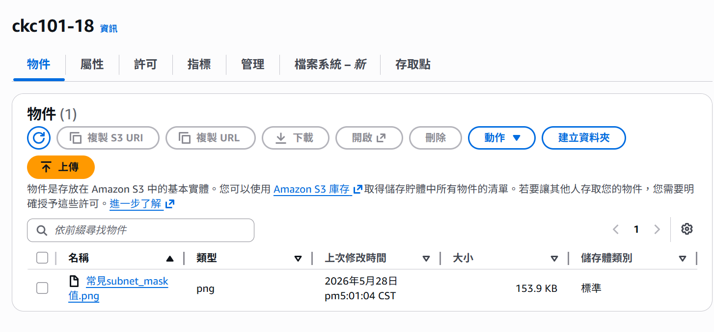

# 0528學習筆記

<aside>
💡

老師建議及問題

- 如果antigravity的額度用完，可以用用看aws的kiro
- docker命名規則是什麼???
- EC2的公有 私有IP
- 研究IAM Identity Center 進行身分驗證(目前都是企業在用)
    
    電腦不能亂借別人，可能會有隱憂，因為已經aws config了，identity center是解決方案
    
</aside>

## 容器化解決環境不一致的的問題

<aside>
💡

#### **大致流程**

解決環境不一致問題

本地端開一新分支 建立dockerfile

build image, push到docker hub

建立ec2, pull image from docker hub

run起來並-p 19191:19191(maping 虛擬機port跟container的port)

再次回到本機 用瀏覽器連 虛擬機的公有IP(但要記得設定security group，才連得近來)

測試確定web沒有問題，將修改內容到push到github做pull request, 給主管審核merge, 把舊分支刪掉

</aside>

### 問題

- 昨天有些人的程式在本機跑得起來，但在虛擬機卻不可行
- 解決辦法 :
    - 不太可能打包整台虛擬機(容量太大，一台可能就10G了)，所以改用docker將程式碼做打包，把整個容器遷移到雲端上

### 實作建立dockerfile

- 請AI做事
    
    Q : 幫我準備一個dockerfile 後續要把程式碼封裝使用的，我的Python版本為 3.14.5(記得要特別提醒他python的版本)
    
    他幫我好產生好了dockerfile了，接下來我要docker build為image
    
- docker build為image
    - **安裝WSL 2 (Windows Subsystem for Linux)** 機制
        
        ```
        wsl --install
        ```
        
    - 下載與安裝 Docker Desktop，選擇windows版本下載
        
        <aside>
        💡
        
        ### 為什麼是選 Windows 版？
        
        我們不是要把環境打包成 Linux 容器嗎？為什麼不選 Linux 版？
        
        - 你的**實體電腦作業系統**是 Windows，所以必須安裝 Windows 專用的應用程式（.exe 安裝檔）。
        - 安裝好之後，Docker Desktop 會自動利用你剛剛搞定的 **WSL 2（微軟的 Linux 子系統）**，在 Windows 裡面幫你變出一個極輕量的 Linux 核心。
        - 也就是說，你是在 **Windows 的環境下，去建立和運行 Linux 的 Container**。
        </aside>
        
        安裝過程中，系統會彈出一個視窗問你設定，請務必確保 **"Use WSL 2 instead of Hyper-V" (使用 WSL 2 取代 Hyper-V)**
        
    - 開始打包image
        
        ```jsx
        docker build -t my-flask-app:v1 .
        💡 指令解析：
         t my-flask-app:v1：這是給你的鏡像取名字（標籤）。名字叫 my-flask-app，版本是 v1
         .（最後面那個點超級重要，千萬別漏掉）：** 這代表「在這個當下目錄尋找 Dockerfile」
        
        docker images
        💡 指令解析：
        在列表上有看到 my-flask-app，且標籤是 v1，就代表你的環境已經完美封裝成功了
        
        docker run -d -p 19191:19191 --name my-running-flask my-flask-app:v1
        💡 指令解析：
        d：讓貨櫃在背景偷偷執行（不會佔用你的終端機畫面）。
        p 19191:19191：把實體電腦的 Port 19191 轉接到 Docker 貨櫃內部的 Port 19191。
        -name my-running-flask：給這個正在跑的貨櫃取個好記的名字
        ```
        

### 如何把剛剛的修改推到遠方的新分支?

為什麼要放在新分支?main是放穩定版本，所以會開一個**新分支（Feature Branch）** 推上去，確認沒問題後再合併

#### 🛠️ 遠端新分支推送 4 步驟

```
1. 建立並切換到新分支
git checkout -b feat-docker

2. 將 Dockerfile 和修改加入暫存區
git add .

3. 提交打包 (Commit)
git commit -m "feat: add Dockerfile for local and AWS environment consistency"

4. 推送到遠端的新分支（關鍵指令）
git push -u origin feat-docker
```

#### 剛剛push完後回到要在 GitHub 網頁上

- 員工視角
    - 建立 Pull Request (PR)
- 主管視角
    - 審查、Merge（合併）到 main
    - 在 GitHub 網頁上刪除雲端分支
- 再切回員工視角
    - 在本機的 PowerShell 刪除本地分支，並pull最新的code：
        
        ```
        # 1. 先切換回主線 main
        git checkout main
        
        # 2. 把 GitHub 上剛剛主管合併完的最新 code 抓下來
        git pull origin main
        
        # 3. 安全地刪除本機的 feature3 分支
        git branch -d feature3
        ```
        

#### 我現在要把docker image拉到amozon linux 2該怎麼做?

先ssh進去ec2

ssh -i "aws-taipei-key.pem" ubuntu@你的AWS公有IP

```
1. 更新系統套件庫並升級
sudo apt update && sudo apt upgrade -y

2. 一鍵安裝 Docker 引擎
sudo apt install docker.io -y

3. 啟動 Docker 服務並設定開機自啟
sudo systemctl start docker
sudo systemctl enable docker

4. 【關鍵精髓】把當前使用者 ubuntu 加入 docker 群組，以後免打 sudo
sudo usermod -aG docker ubuntu

5.再將docker image pull 並 run 在 ec2 中
docker pull chuchunkuan/my-flask-app:v1
docker run -d -p 19191:19191 --name my-aws-flask chuchunkuan/my-flask-app:v1

6.再回到本機端訪問剛剛run的container
http://你的AWS公有IP:19191
```

### 新增圖片上傳的新服務，使用雲端S3服務

<aside>
💡

#### **大致流程**

先給開發人員群組相關權限(S3FullAccess)

拿到開發人員金鑰之後

aws cli

aws configure

建立bucket

然後開發人員就可以開始開發

開發完畢一樣做cicd流程

解決EC2使用S3權限問題

</aside>

#### 我要給開發人員群組developmenat group相關權限，如何操作?


#### 我現在已經有開發人員的金鑰了，現在要用本地搭配access key去存取aws s3

```
1. 安裝 AWS CLI
msiexec.exe /i https://awscli.amazonaws.com/AWSCLIV2.msi

2. 開始設定金鑰（像登入帳號一樣）
aws configure

3. aws configure之後，輸入aws s3 ls 如果沒有報錯
，但也沒有報有任何資料 才是正常的
```

#### S3的核心名詞

- bucket(裝檔案的桶子)
- object(被裝的檔案)

#### aws cli 建立一個bucket(名稱取:ckc101-18) 要建在台灣

```jsx
aws s3api create-bucket --bucket ckc101-18 --region ap-east-2 --create-bucket-configuration LocationConstraint=ap-east-2
```

#### 建好之後 開發人員可以開發了

直接請antigravity的ai做新功能(feature 3)，在web app上 當用戶訪問feature 3時，檔案上傳， 會去串aws s3 的bucket(名稱為ckc-18)，因為以後要部署到EC2，要以安全的方式做，程式碼內不可以有credential

建立好如下，可成功透過網頁上傳檔案



#### 重複ci/cd流程

一樣是push code到github 、push image到dockerhub…..

#### 解決EC2中要使用S3功能，權限問題

<aside>
💡

ec2裡面是不可以用金鑰去存取服務的，只有你的本機可以用金鑰把group的policy綁定

那ec2如何取得權限呢?必須在IAM裡面建立role，然後給他相關權限的policy，再將其綁訂在ec2上

</aside>